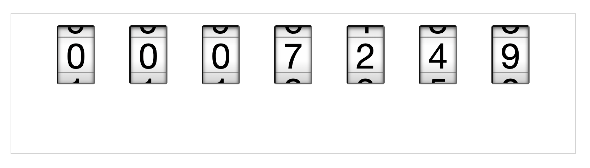

# AnalogClock Power Platform Component

## Description
This is a custom component for Power Platform that displays an analog clock written in React.

## Development

### Prerequisites
- [.NET SDK](https://dotnet.microsoft.com/download) - Ensure that you have the .NET SDK installed on your machine.

### Setup
1. Clone the repository: `git clone https://github.com/your-username/your-repo.git`
2. Navigate to the project directory: `cd rotary_clock`
3. Install the necessary dependencies: `npm install`
4. Start the development server: `npm start`

### Deployment
To build the component for deployment, use the following command: `npm run build`

### Installation
1. Download the solution file from the repository.
2. Import the solution file into your Power Platform environment.
3. After the import is successful, you can find the AnalogClock component in the custom components section.

## Usage
To use the AnalogClock component:
1. Open the form where you want to add the component.
2. Select the AnalogClock component from the custom components section.
3. Save and publish the form.

## Contributing
Pull requests are welcome. For major changes, please open an issue first to discuss what you would like to change.

## License
[MIT](https://choosealicense.com/licenses/mit/)